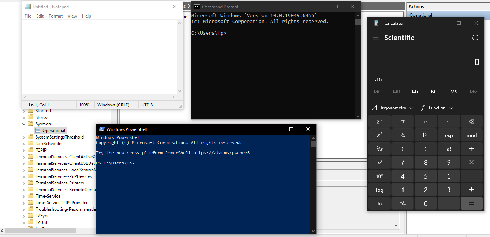

# Sysmon Process Creation Investigation

## Introduction

This project demonstrates the investigation of Windows process creation events using Sysmon Event ID 1.

The objective of the lab was to generate process activity, analyze Sysmon telemetry, investigate process execution details, and understand how security analysts use process creation events during incident investigations and threat hunting activities.

Sysmon provides detailed visibility into process execution, command-line arguments, parent-child process relationships, and user activity, making it one of the most valuable sources of telemetry for SOC analysts and defenders.

---

## Lab Environment

* Windows 10/11
* Sysmon
* Event Viewer

---

## Investigation Objectives

* Analyze Sysmon Event ID 1
* Investigate process creation events
* Identify executable paths
* Review command-line activity
* Analyze parent-child process relationships
* Understand process monitoring techniques

## 1. Sysmon Operational Log Overview

The investigation began by accessing the Sysmon Operational log through Windows Event Viewer.

Sysmon records detailed system activity and provides enhanced visibility into process execution, network connections, file creation events, and other security-relevant activities.

This log is commonly used by SOC analysts and threat hunters during security investigations.

## 2. Process Activity Generation

Several applications were executed to generate process creation events within the system.

The following applications were launched:

* Command Prompt (cmd.exe)
* PowerShell (powershell.exe)
* Notepad (notepad.exe)
* Calculator

Each application execution generated Sysmon Event ID 1 records, which were later investigated.

## 3. Filtering Event ID 1

The Sysmon log was filtered using Event ID 1.

Event ID 1 represents a Process Creation event and is generated every time a process starts within the operating system.

This event type is one of the most important telemetry sources used during security monitoring and threat hunting activities.

