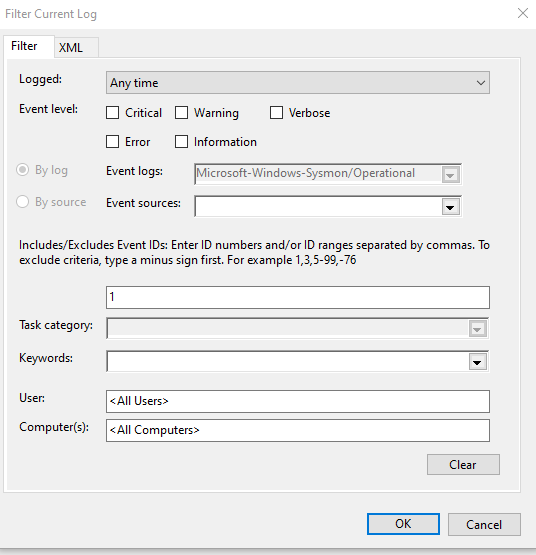
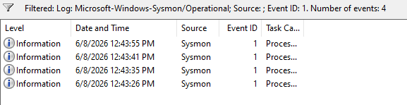
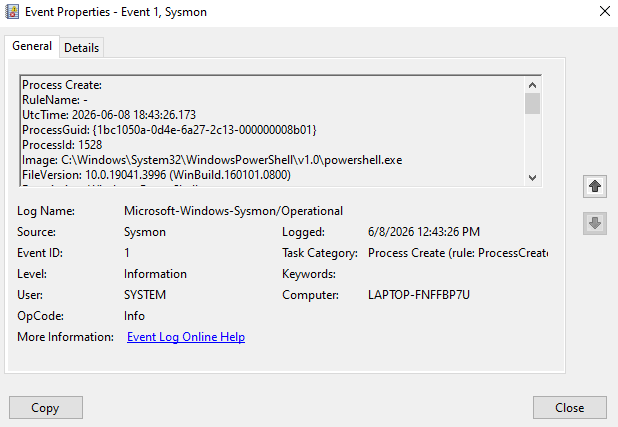
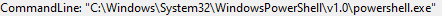

# Sysmon Process Creation Investigation

## Introduction

This project demonstrates the investigation of Windows process creation events using Sysmon Event ID 1.

The objective of the lab was to generate process activity, analyze Sysmon telemetry, investigate process execution details, and understand how security analysts use process creation events during incident investigations and threat hunting activities.

Sysmon provides detailed visibility into process execution, command-line arguments, parent-child process relationships, and user activity, making it one of the most valuable sources of telemetry for SOC analysts and defenders.

---

## Lab Environment

* Windows 10/11
* Sysmon
* Event Viewer

---

## Investigation Objectives

* Analyze Sysmon Event ID 1
* Investigate process creation events
* Identify executable paths
* Review command-line activity
* Analyze parent-child process relationships
* Understand process monitoring techniques

## 1. Sysmon Operational Log Overview

The investigation began by accessing the Sysmon Operational log through Windows Event Viewer.

Sysmon records detailed system activity and provides enhanced visibility into process execution, network connections, file creation events, and other security-relevant activities.

This log is commonly used by SOC analysts and threat hunters during security investigations.

## 2. Process Activity Generation

Several applications were executed to generate process creation events within the system.

The following applications were launched:

* Command Prompt (cmd.exe)
* PowerShell (powershell.exe)
* Notepad (notepad.exe)
* Calculator

Each application execution generated Sysmon Event ID 1 records, which were later investigated.

## 3. Filtering Event ID 1

The Sysmon log was filtered using Event ID 1.

Event ID 1 represents a Process Creation event and is generated every time a process starts within the operating system.

This event type is one of the most important telemetry sources used during security monitoring and threat hunting activities.

## 4. Process Creation Events Identified

After applying the filter, multiple process creation events were identified.

The recorded events included:

* cmd.exe
* powershell.exe
* notepad.exe
* CalculatorApp.exe

The successful detection of these events confirmed that Sysmon was correctly monitoring process activity within the system.

## 5. PowerShell Process Investigation

A detailed investigation was performed on the PowerShell process creation event.

Sysmon provided valuable information including executable path, command-line arguments, process identifiers, user context, and parent process information.

This level of visibility is extremely valuable during incident response and threat hunting investigations.

## 6. Image Field Analysis

The Image field identified the executable responsible for the process creation event.

Recorded value:

`C:\Windows\System32\WindowsPowerShell\v1.0\powershell.exe`

The path corresponds to the legitimate Microsoft PowerShell executable installed as part of the Windows operating system.

No indicators of suspicious execution paths were identified during the investigation.

## 7. Command Line Analysis

The CommandLine field recorded the exact command used to launch PowerShell.

Recorded value:

`"C:\Windows\System32\WindowsPowerShell\v1.0\powershell.exe"`

The process was executed without additional arguments, scripts, or encoded commands.

This behavior is consistent with normal user activity.

## 8. Parent Process Analysis

The ParentImage field identified the process responsible for launching PowerShell.

Recorded value:

`C:\Windows\explorer.exe`

Explorer.exe is the Windows graphical shell and commonly serves as the parent process when applications are launched manually by a user.

This finding indicates that PowerShell was initiated through normal user interaction rather than by an automated process or suspicious activity.

